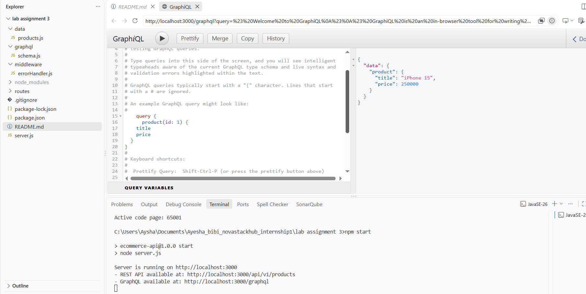

# CSC337 Lab Assignment 03 - Enterprise RESTful APIs and GraphQL

This repository contains the solution for Lab Assignment 03. It implements a local Node.js/Express API for an E-Commerce system solving three major issues:

1. **Unstandardized URIs & Server Crashes**: Follows RESTful naming conventions (`/api/v1/products`) with centralized JSON error handling preventing server crashes on bad client input.
2. **Duplicate Deductions**: Implementing an **idempotent** `PUT` endpoint to safely update resources even on repeated network retries.
3. **The REST Over-Fetching Dilemma**: Includes two solutions:
   - Field filtering in REST: `?fields=title,price`
   - Dedicated GraphQL endpoint at `/graphql`

## Installation and Setup

1. Open your terminal in this directory.
2. Install dependencies:
   ```bash
   npm install
   ```
3. Start the server:
   ```bash
   npm start
   ```
   *(Or use `npm run dev` to start with hot-reloading using node --watch)*

The API will run on `http://localhost:3000`.

## Testing the Requirements

### 1. REST API
- **GET All Products**: `GET http://localhost:3000/api/v1/products`
- **Filtering & Pagination**: `GET http://localhost:3000/api/v1/products?category=electronics&limit=1`
- **GET Single Product**: `GET http://localhost:3000/api/v1/products/1`
- **Field Selection (Over-fetching solution)**: `GET http://localhost:3000/api/v1/products/1?fields=title,price`

- **POST Create Product (Returns 201)**:
  ```http
  POST http://localhost:3000/api/v1/products
  Content-Type: application/json
  
  { "title": "AirPods Pro", "price": 45000, "category": "electronics", "stock": 50 }
  ```

- **PUT Update Product (Idempotent)**:
  ```http
  PUT http://localhost:3000/api/v1/products/1
  Content-Type: application/json
  
  { "title": "iPhone 15 Pro", "price": 300000, "category": "electronics" }
  ```

- **DELETE Product**: `DELETE http://localhost:3000/api/v1/products/1`

### 2. Standardized Error Handling (400 / 404)
- **Invalid Data (400)**: Try executing a `POST` request without sending a `title` or `price`.
- **Invalid ID (404)**: Try to GET `http://localhost:3000/api/v1/products/999`.

### 3. GraphQL Solution (Over-Fetching)
Open `http://localhost:3000/graphql` in your browser to access the GraphiQL interface and run:
```graphql
query {
  product(id: 1) {
    title
    price
  }
}
```
This fetches *only* the requested fields, avoiding over-fetching entirely.

