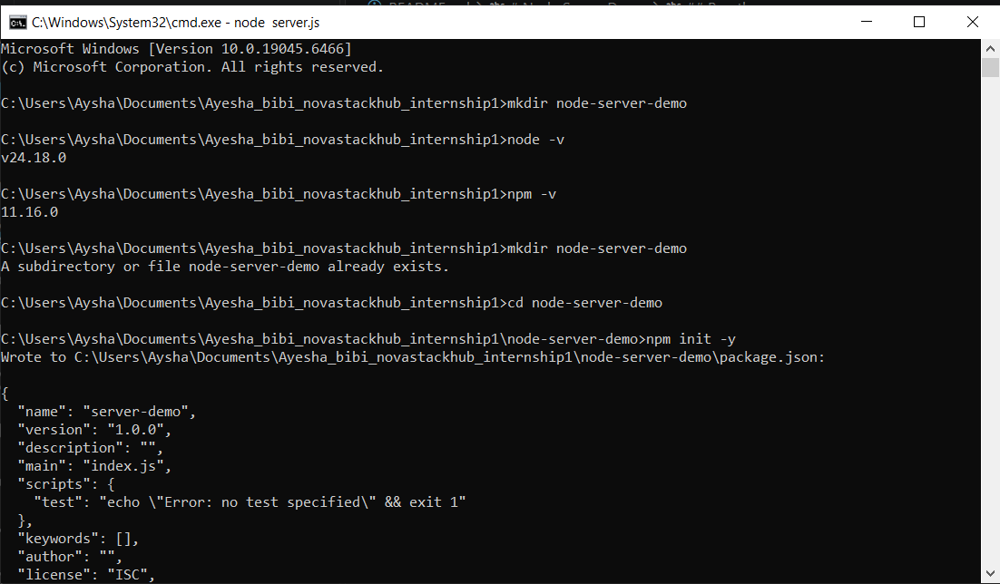
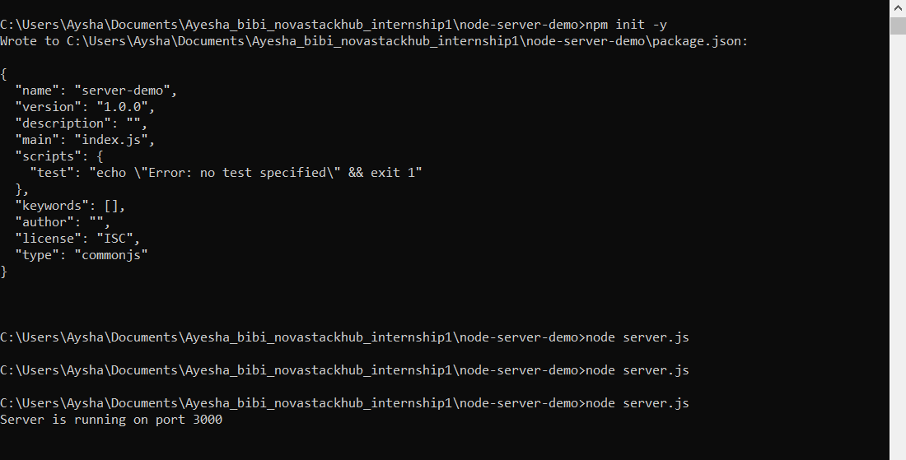
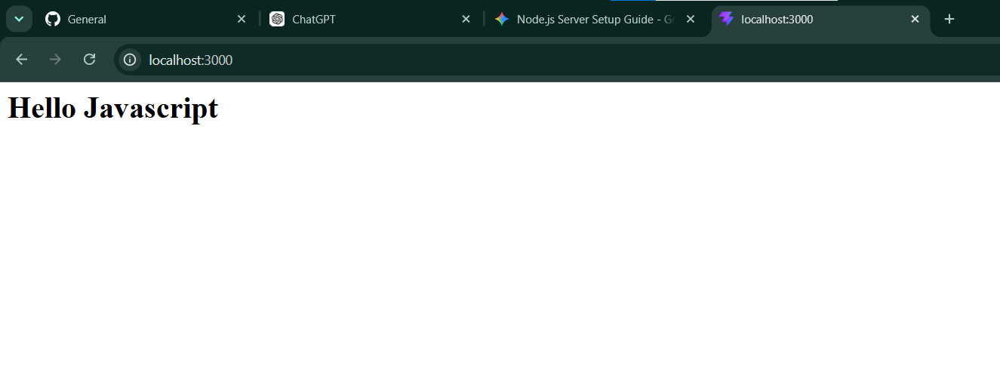

# Node Server Demo

A simple Node.js HTTP server that responds with a basic HTML page.

## Project overview

This project creates a local server using the built-in `http` module and listens on port `3000`. When a request is made, it returns:

- HTTP status: `200`
- Content type: `text/html`
- Response: `Hello Javascript`

## Prerequisites

- Node.js installed on your machine

## Run the server

1. Open a terminal in the project folder.
2. Run:

```bash
node server.js
```

3. Open your browser and visit:

```text
http://localhost:3000
```

You should see the message `Hello Javascript`.

## Files

- `server.js` — creates and starts the HTTP server
- `package.json` — project metadata and scripts





