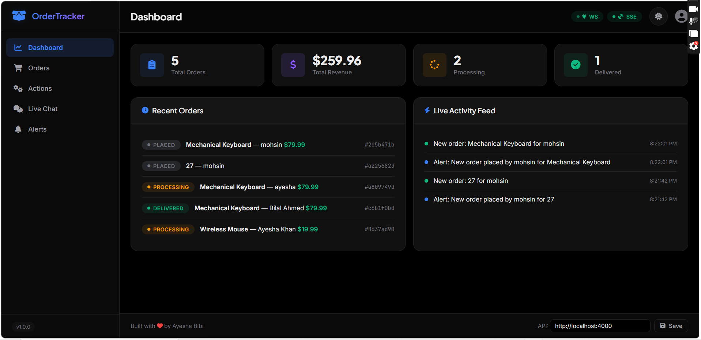
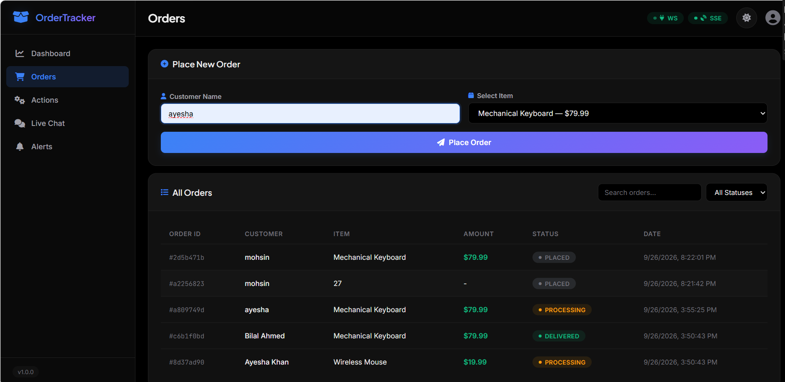
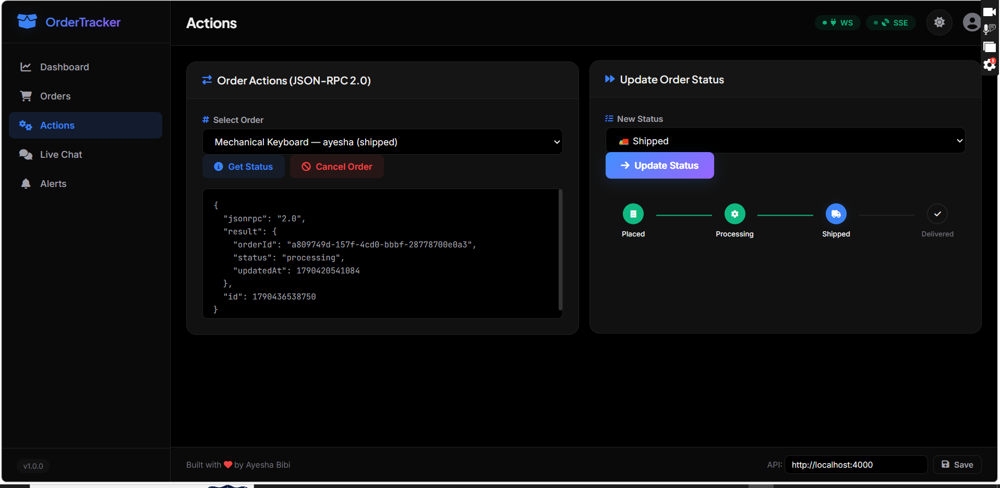
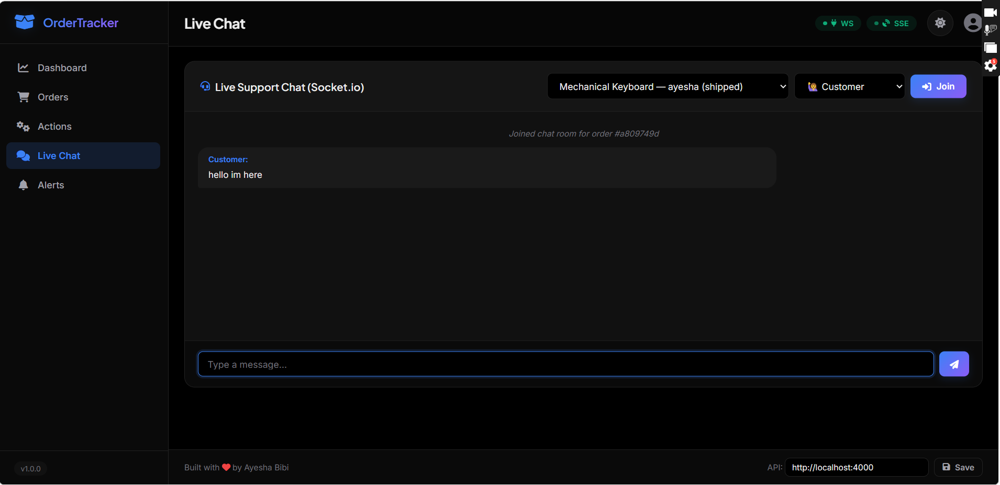
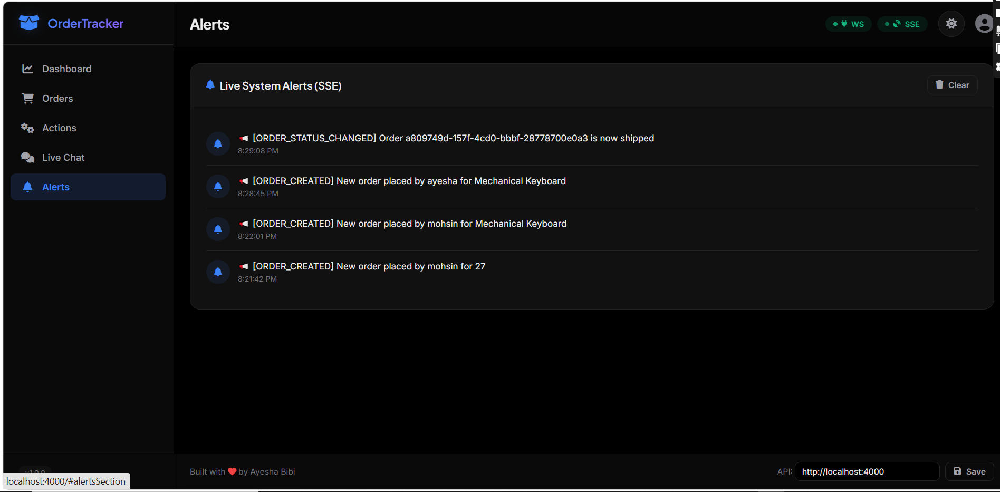

# 📦 Real-Time Order Tracking & Live Support System

**CSC337 — Lab Assignment 04**

A full-stack app that demonstrates four communication protocols side by side:

| # | Protocol | Purpose | Endpoint |
|---|----------|---------|----------|
| 1 | REST | CRUD for orders & catalog | `/api/v1/orders`, `/api/v1/catalog` |
| 2 | WebSockets (Socket.io) | Live order-status push + 1-on-1 customer↔support chat | root Socket.io namespace |
| 3 | JSON-RPC 2.0 | Method-based actions (e.g. cancel an order) | `POST /rpc` |
| 4 | Server-Sent Events | One-way push of system-wide alerts | `GET /events` |

> A GraphQL endpoint was not implemented — REST was chosen to satisfy
> requirement #1 ("REST **or** GraphQL"). Swapping in `/graphql` would mean
> adding `graphql` + `express-graphql`/`apollo-server-express` and wrapping
> the same `data/store.js` functions as resolvers.

---

## 🏗️ Architecture

```
order-tracker/
├── backend/
│   ├── server.js              # Express + HTTP server + Socket.io bootstrap
│   ├── data/store.js          # In-memory "database" shared by every protocol
│   ├── routes/orders.js       # REST endpoints
│   ├── rpc/rpcHandler.js      # JSON-RPC 2.0 dispatcher
│   ├── sse/sseManager.js      # SSE client registry + broadcastAlert()
│   ├── sockets/socketHandler.js # Socket.io rooms, chat, status push
│   └── package.json
└── frontend/
    ├── index.html             # Single page, four panels (one per protocol)
    ├── app.js                 # Vanilla JS client for all four protocols
    ├── style.css
    └── config.js              # Backend base URL (editable in the UI footer)
```

All four protocols read/write the **same in-memory order store**, so an
action in one protocol is visible through the others in real time:
placing an order (REST) fires an SSE alert; cancelling it (JSON-RPC) pushes
a live status update over Socket.io to anyone watching that order's chat
room; advancing its status (REST PATCH) does the same.

The in-memory store resets on every server restart — swap `data/store.js`
for a real database without touching the REST/RPC/socket layers, since
they only call its exported functions.

---

## 🔌 WebSocket (Socket.io) events

Connect with a query string identifying the user:
`io(BASE_URL, { query: { role: 'customer' | 'support', name: 'Ayesha' } })`

Rooms are named `order-<orderId>`. A customer and a support agent who both
join the same order's room see each other's messages and that order's
status updates live.

| Event | Direction | Payload | Description |
|---|---|---|---|
| `connected` | server → client | `{ socketId, role, name }` | Sent right after connection |
| `joinRoom` | client → server | `{ orderId }` | Join an order's chat/status room |
| `leaveRoom` | client → server | `{ orderId }` | Leave the room |
| `chatMessage` | both ways | `{ orderId, sender, role, message, timestamp }` | 1-on-1 chat message, relayed to everyone else in the room |
| `typing` | both ways | `{ orderId, name, isTyping }` | Typing indicator |
| `systemMessage` | server → client | `{ message, orderId, timestamp }` | "X joined/left the chat" |
| `orderStatusUpdate` | server → client | `{ orderId, status, updatedAt }` | Pushed whenever REST PATCH or the `cancelOrder` RPC method changes an order's status |
| `disconnect` | client → server (auto) | — | Triggers a `systemMessage` "left the chat" to the room |

## 🧾 JSON-RPC 2.0 methods (`POST /rpc`)

Request shape: `{ "jsonrpc": "2.0", "method": "...", "params": {...}, "id": 1 }`

| Method | Params | Result |
|---|---|---|
| `cancelOrder` | `{ orderId }` | `{ orderId, status: "cancelled" }` — also emits `orderStatusUpdate` over Socket.io and an SSE alert |
| `getOrderStatus` | `{ orderId }` | `{ orderId, status, updatedAt }` |
| `listOrders` | — | `{ orders: [...] }` |
| `listMethods` | — | `{ methods: [...] }` |

Standard JSON-RPC error codes are used: `-32600` invalid request,
`-32601` method not found, `-32602` invalid params, `-32603` internal error,
and a custom `-32000` for "order already closed."

## 📡 Server-Sent Events (`GET /events`)

Plain `EventSource` connection. Two named events:

- `connected` — fired once on connect: `{ message }`
- `alert` — fired on every order create/status-change/cancel:
  `{ type: "ORDER_CREATED" | "ORDER_STATUS_CHANGED" | "ORDER_CANCELLED", message, orderId, timestamp }`

A `retry: 3000` hint and a 25s comment-line heartbeat keep the connection
alive through proxies (Render/most PaaS free tiers idle-timeout otherwise).

## 🌐 REST endpoints (`/api/v1`)

| Method | Path | Body | Description |
|---|---|---|---|
| GET | `/catalog` | — | List purchasable items |
| GET | `/orders` | — | List all orders |
| GET | `/orders/:id` | — | Get one order |
| POST | `/orders` | `{ customerName, item }` | Create an order (fires SSE `ORDER_CREATED`) |
| PATCH | `/orders/:id/status` | `{ status }` | Update status (fires Socket.io `orderStatusUpdate` + SSE `ORDER_STATUS_CHANGED`) |

---

## ▶️ Local setup

**Backend**
```bash
cd backend
npm install
cp .env.example .env      # edit ALLOWED_ORIGIN if needed
npm start                  # http://localhost:4000
```

**Frontend**
```bash
cd frontend
# no build step — any static server works, e.g.:
npx serve .
# or just open index.html directly in a browser
```

By default the frontend points at `http://localhost:4000` (see
`config.js`). You can also change the backend URL live from the input box
in the page footer — it's saved to `localStorage` and the page reloads.

**Try it end to end:**
1. Open the page in two browser tabs/windows.
2. In tab 1, set role to "Customer" and reconnect; in tab 2 set role to
   "Support Agent" and reconnect.
3. Place an order in tab 1 (REST) — watch the SSE alert appear in both tabs.
4. Both tabs: pick that order in the chat panel and click "Join Chat" —
   send messages back and forth (Socket.io).
5. In tab 2, click "Cancel Order" (JSON-RPC) — both tabs get a live
   `orderStatusUpdate` and an SSE alert without refreshing.

---

## ☁️ Deployment

### Backend → Render (or Railway)
1. Push this repo to GitHub.
2. Render: **New → Web Service** → connect the repo.
3. Root directory: `backend`
4. Build command: `npm install`
5. Start command: `npm start`
6. Add an environment variable `ALLOWED_ORIGIN` set to your deployed
   frontend's URL (e.g. `https://your-app.vercel.app`) once you have it —
   Render sets `PORT` automatically, so leave that alone.
7. Deploy. Note the resulting URL, e.g. `https://order-tracker-backend.onrender.com`.

Railway steps are equivalent: New Project → Deploy from GitHub → set root
directory to `backend` → it auto-detects `npm start`.

### Frontend → Vercel (or Netlify)
1. Before deploying, either edit `frontend/config.js`'s
   `window.DEFAULT_API_BASE` to your Render/Railway URL, or just deploy
   as-is and set it once from the footer input box in the live site
   (it persists in `localStorage`).
2. Vercel: **New Project** → import the repo → set root directory to
   `frontend` → framework preset "Other" (static) → Deploy.
3. Netlify: drag-and-drop the `frontend` folder, or connect the repo with
   base directory `frontend` and no build command.
4. Once you have the frontend's live URL, go back to Render and set
   `ALLOWED_ORIGIN` to that URL so CORS/Socket.io accept it, then redeploy
   the backend.

---

## 📝 Notes / possible extensions

- Swap `data/store.js` for MongoDB/Postgres without touching the REST,
  RPC, or socket layers — they only call its exported functions.
- Add JWT auth so `role` on the socket handshake can't be spoofed.
- Add a GraphQL endpoint alongside REST for the same resource by wrapping
  `data/store.js` functions as resolvers.






